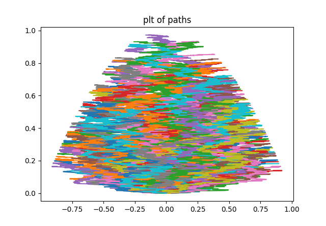
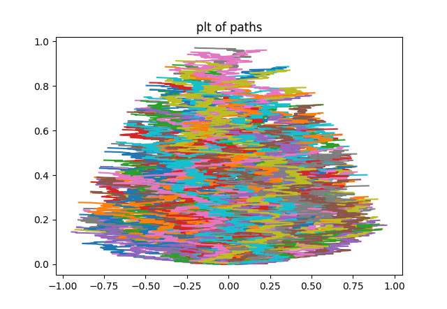

# prototype-Monte-Carlo
In this repo we test recursive Brownian simulation (need a better name for this).

## What is  recursive Brownian simulation?
Recursive Brownian simulation simulates Brownian paths with a certain
stopping criteria. This generalizes Walk on Spheres that has as stopping criteria
a time independent space boundary.

In the next plot you can see how recursive Brownian simulation
simulates exit points with stopping criteria a time-space parabola boundary
and as base a triangular time-space boundary.

The way recursive Brownian simulation works is by recursively sampling
of a base stopping criteria until the derived stopping criteria
is closely met.

In the last example only exit points were simulated and a triangular base criteria was used (generated
by regular Brownian motion simulations) which of directly follow scaled versions of it 
because of the scaling symmetry of Brownian motion. 
With this triangular base you can approximate simulation of a big class of 
stopping criteria.

## Does recursive Brownian simulation work?

To test that recursive Brownian simulation works.
We tested last example against (regular Brownian motion simulations).

## same example but with whole paths
We added code to visualize this for whole paths, note that in practice
you could only calculate the part of the path you actually need and
the exit point of each recursion.

This is recursive full Brownian motion with parabolic
time dependent boundary with as base a cone.

For reference the same paths but with Euler discretisation.

