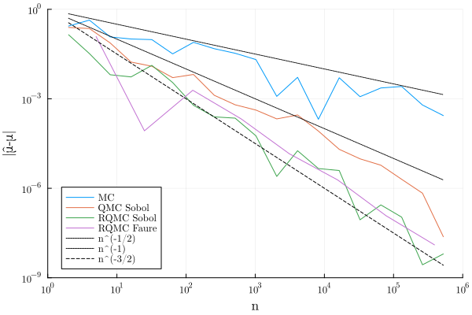

# Quasi MC example

```julia
using QuasiMonteCarlo, Random, Distributions
using Plots;
f1(𝐱) = prod(1 + √(12) / 5 * (xⱼ - 1 / 2) for xⱼ in 𝐱)
μ_exact = 1 # = ∫ f₁(𝐱) d⁵𝐱
default(fontfamily = "Computer Modern");
Random.seed!(1234)
d = 5 # Dimension (= prime base for Faure net)
b = 2 # Base for Sobol net
m_max = 6
m_max_Faure = 8
N = b^m_max
println(N)

# Generate sequences
seq_MC = QuasiMonteCarlo.sample(N, d, Uniform()) # Monte Carlo i.i.d. Uniform sampling
seq_QMC_Sobol = QuasiMonteCarlo.sample(N, d, SobolSample()) # Sobol net
seq_RQMC_Sobol = QuasiMonteCarlo.sample(N,
    d,
    SobolSample(R = OwenScramble(base = b, pad = 32))) # Randomized version of Sobol net
println(size(seq_RQMC_Sobol))
scatter(seq_RQMC_Sobol[1,:], zeros(N))
scatter!(seq_RQMC_Sobol[1,:], ones(N))
seq_RQMC_Faure = QuasiMonteCarlo.sample(d^m_max_Faure,
    d,
    FaureSample(R = OwenScramble(base = d, pad = 32))) # Randomized version of Faure net

# Estimate the integral for different n with different estimator μ̂ₙ
μ_MC = [mean(f1(x) for x in eachcol(seq_MC[:, 1:(b^m)])) for m in 1:m_max]
μ_QMC_Sobol = [mean(f1(x) for x in eachcol(seq_QMC_Sobol[:, 1:(b^m)])) for m in 1:m_max]
μ_RQMC_Sobol = [mean(f1(x) for x in eachcol(seq_RQMC_Sobol[:, 1:(b^m)])) for m in 1:m_max]
μ_RQMC_Faure = [mean(f1(x) for x in eachcol(seq_RQMC_Faure[:, 1:(d^m)]))
                for m in 1:m_max_Faure]

# Plot the error |μ̂-μ| vs n
plot(b .^ (1:m_max), abs.(μ_MC .- μ_exact), label = "MC")
plot!(b .^ (1:m_max), abs.(μ_QMC_Sobol .- μ_exact), label = "QMC Sobol")
plot!(b .^ (1:m_max), abs.(μ_RQMC_Sobol .- μ_exact), label = "RQMC Sobol")
plot!(d .^ (1:m_max_Faure), abs.(μ_RQMC_Faure .- μ_exact), label = "RQMC Faure")
plot!(n -> n^(-1 / 2), b .^ (1:m_max), c = :black, s = :dot, label = "n^(-1/2)")
plot!(n -> n^(-1), b .^ (1:m_max), c = :black, s = :dot, label = "n^(-1)")
plot!(n -> n^(-3 / 2), b .^ (1:m_max), c = :black, s = :dash, label = "n^(-3/2)")
# n^(-3/2) is the theoretical scaling for scrambled nets e.g. Theorem 17.5. in https://artowen.su.domains/mc/qmcstuff.pdf
xlims!(1, 1e6)
ylims!(1e-9, 1)
xaxis!(:log10)
yaxis!(:log10)
xlabel!("n", legend = :bottomleft)
ylabel!("|μ̂-μ|")
```



# Poisson expansion of a linear ODE

Consider following linear ODE:

$$
y_{t} = A(t)y.
$$

In the second dutch presentation we present following result:

$$
    \begin{aligned}
        y(t) & = E \left[\prod_{k=0}^{N_{t}}\left( I + \frac{A(T_{k})}{\sigma} \right)    \right] y(0)                                             \\
             & = \sum_{n=0}^{\infty}\frac{\sigma^{n} t ^{n}}{n!} E \left[\prod_{k=0}^{n}\left( I + \frac{A(T^{n}_{k})}{\sigma} \right)    \right] y(0)
    \end{aligned}
.
$$

With $(T^{n}_{k})_{1 \le  k \le n }$ =

```julia
n = 10 # this needs to be a number
sort([rand() for _ in 1:n])
```

The idea is to cut off the sum for some $n$. Then we obtain low dimensional
integrals we can approx with qmc.

# Example problem

$$
\begin{aligned}
y_0 &= \begin{bmatrix} 1 \\ 1 \end{bmatrix}, \\
A(t) &= \begin{bmatrix} 1+\cos(t) & -\cos(t) \\ \cos(t) & 1-\cos(t) \end{bmatrix}, \\
\text{sol}(t) &= \begin{bmatrix} e^t \\ e^t \end{bmatrix}
\end{aligned}
.
$$

# Generating sorted n uniform QMC

We tried this but cant make it work
we are reading a book on quasi monte carlo
now. There is a section on Poisson processes
Strategies for Quasi-Monte Carlo but
were not sure we are going to try that.

```julia

using Sobol, Plots

n = 10
sobol_seq = SobolSeq(n)

function generate_and_plot_sobol_samples!(plt, n, level, skip_steps)
    # Skip a certain number of steps in the Sobol sequence
    skip(sobol_seq, skip_steps)

    # Generate and sort samples
    sorted_samples = sort(next!(sobol_seq))
    y_values = fill(level, length(sorted_samples))  # Set y-coordinates to the level
    scatter!(plt, 1:n, y_values, label = "")  # Use 1:n as x-coordinates for clarity
end

n = 10  # Number of samples per simulation
simulations = 10  # Number of simulations
level_offset = 1  # Offset between each simulation's level
skip_steps = 100  # Number of steps to skip in the Sobol sequence for each simulation

plt = plot(title = "Sobol Sequence Simulations", xlabel = "Sample Index", ylabel = "Simulation Level", legend = :topright)

for sim in 1:simulations
    generate_and_plot_sobol_samples!(plt, n, sim * level_offset, skip_steps)
    skip_steps+=100
end

display(plt)
```

# Quasi MC on the Poisson proces

```julia
using Sobol, Distributions, Plots

function quasi_random_poisson(lambda::Float64, n::Int)
    sobol_gen = SobolSeq(1)  # Initialize a Sobol sequence generator for 1 dimension
    sobol_samples = [next!(sobol_gen)[1] for _ in 1:n]  # Generate n points

    pos =Poisson(lambda)
    ss = quantile.(pos,sobol_samples)
    print(ss)
    p= histogram(ss,label="",bins=30)

    display(p)
end

quasi_random_poisson(5.0,2^6)
pos = Poisson(10.0)
histogram(quantile.(pos,rand(100)),label="",bins=20)
```

```julia
using Random
using Sobol, Distributions, Plots

using LinearAlgebra
function Y(tt, sig, A::Function, y0)
    sol = y0
    for s in tt
        sol += A(s) * sol  ./ sig
    end
    sol
end

function qtimes(t,sig,sobol_gen)
N = quantile(Poisson(t*sig),next!(sobol_gen) )[1]
sort!(rand(N)) .*t
end

function qqtimes(t,sig,sobol_gen2)
Ns = quantile.(Poisson(t*sig/2),next!(sobol_gen2) )
u1 = rand(Ns[1])
u2 = 1 .+ rand(Ns[2])
sort!(vcat(u1,u2)) .*t/2
end

function times(t,sig)
N = quantile(Poisson(t*sig),rand() )[1]
sort!(rand(N)) .*t
end

# y0 = [1; 1]
# A(t) = [1+cos(t) -cos(t); cos(t) 1-cos(t)]
# sol(t) = [exp(t); exp(t)]
# sig = 10.0
# nsim = 10^2
# t = 2

# y0 = 1
# Ap(t) = (t < 0.5) ? 1 : -1
# A(t) = Ap(t - floor(t))
# solp(t) = (t < 0.5) ? exp(t) : exp(1 - t)
# sol(t) = solp(t - floor(t))
# nsim = 10^2
# sig = 10.0
# t=3

y0 = 1
A(t) = 2*t
sol(t) = exp(t^2)
nsim = 10^2
sig = 10.0
t=1

Random.seed!(24)
sobol_gen = SobolSeq(1)
qsol = sum(Y(qtimes(t,sig,sobol_gen),sig,A,y0) for _ in 1:nsim)/nsim
rsol = sum(Y(times(t,sig),sig,A,y0) for _ in 1:nsim)/nsim
println(qsol)
println(rsol)


# Initialize variable
sig = 10.0 # Assuming a fixed sig value for demonstration
t = 1
nsim_values = Int.(round.(10 .^ (1.0:0.02:4))) # Denser sampling up to fifth order
nsim_values = unique(vcat(nsim_values, Int.(round.(10 .^(4:0.5:6))))) # Combine and ensure uniqueness

qsol_values = []
qqsol_values = []
rsol_values = []

Random.seed!(26)
# Loop over nsim values
for nsim in nsim_values
    sobol_gen = SobolSeq(1)
    sobol_gen2 = SobolSeq(2)

    qsol = sum(Y(qtimes(t,sig, sobol_gen), sig, A, y0) for _ in 1:nsim) / nsim
    qqsol = sum(Y(qqtimes(t,sig, sobol_gen2), sig, A, y0) for _ in 1:nsim) / nsim
    rsol = sum(Y(times(t,sig), sig, A, y0) for _ in 1:nsim) / nsim
    push!(qsol_values, qsol)
    push!(qqsol_values, qqsol)
    push!(rsol_values, rsol)
end

# Assuming sol(1) and norm are defined elsewhere
qerror = [norm(s-sol(t)) for s in qsol_values]
qqerror = [norm(s-sol(t)) for s in qqsol_values]
rerror = [norm(s-sol(t)) for s in rsol_values]

using Plots

# Plotting
p = plot(nsim_values, qerror, label="Q-Solution", title="Convergence Plot", xlabel="nsim", ylabel="Solution Value", xscale=:log10, yscale=:log10)
plot!(p,nsim_values, qqerror, label="QQ-Solution", title="Convergence Plot", xlabel="nsim", ylabel="Solution Value", xscale=:log10, yscale=:log10)
plot!(p, nsim_values, rerror, label="R-Solution", xscale=:log10, yscale=:log10)

plot!(p, nsim_values, nsim_values .^ (-0.5), label="-0.5", linestyle=:dash)
plot!(p, nsim_values, nsim_values .^ (-1), label="-1", linestyle=:dash)
display(p)


```

 <br>
Stratifying the N is definitely a thing. <br>  
The same plot for sig would be interesting.

```julia
using Random, Sobol, Distributions, Plots, LinearAlgebra

function Y(tt, sig, A::Function, y0)
    sol = y0
    for s in tt
        sol += A(s) * sol ./ sig
    end
    sol
end

function times(t,sig)
N = quantile(Poisson(t*sig),rand() )[1]
sort!(rand(N)) .*t
end

function qtimes(t, sig, sobol_gen, k)
    Ns = quantile.(Poisson(t * sig / k), next!(sobol_gen))
    sort!(vcat([rand(Ns[i]) .+ i .- 1 for i in 1:k]...)) .* t / k
end

function convergence_compare(sig_values, nsim_values, t, y0, A, sol,k)
    p = plot()
    for nsim in nsim_values
        qsol_values = []
        rsol_values = []
        for sig in sig_values
            sobol_gen = SobolSeq(k)
            qsol = sum(Y(qtimes(t, sig, sobol_gen, k), sig, A, y0) for _ in 1:nsim) / nsim
            rsol = sum(Y(times(t,sig), sig, A, y0) for _ in 1:nsim) / nsim
            push!(qsol_values, qsol)
            push!(rsol_values, rsol)
        end
        qerror = [norm(s - sol(t)) for s in qsol_values]
        rerror = [norm(s - sol(t)) for s in rsol_values]
        plot!(p,sig_values, qerror, label="Q-Solution nsim=$nsim", title="Convergence Plot", xlabel="sig", ylabel="Error", xscale=:log10, yscale=:log10)
        plot!(p, sig_values, rerror, label="R-Solution nsim=$nsim", xscale=:log10, yscale=:log10)
    end
    plot!(p,sig_values, sig_values .^(-0.5),label="-0.5",linestyle=:dash)
    plot!(p,sig_values, sig_values .^(-1),label="-1",linestyle=:dash)
    display(p)
end

# Define parameters
# y0 = [1; 1]
# A(t) = [1 + cos(t) -cos(t); cos(t) 1 - cos(t)]
# sol(t) = [exp(t); exp(t)]
# t = 2


# y0 = 1
# Ap(t) = (t < 0.5) ? 1 : -1
# A(t) = Ap(t - floor(t))
# solp(t) = (t < 0.5) ? exp(t) : exp(1 - t)
# sol(t) = solp(t - floor(t))
# t=3

y0 = 1
A(t) = 2*t
sol(t) = exp(t^2)
nsim = 10^2
sig = 10.0
t=0.2


sig_values = Int.(round.(10 .^(1.0:0.05:3.5)))
# sig_values = Int.(round.(10 .^(1.0:0.1:2)))
nsim_values = [1, 100]
# nsim_values = [1, 100,10000]
k = 1

Random.seed!(21)
# Call the function
convergence_compare(sig_values, nsim_values, t, y0, A, sol,k)

```

Ok conditioning on N also helps convergence on sig


the better convergence when simply conditioning on N is works probably
for only for constant coefficient problems <br>

test parallel complexity:

```julia
using Profile
using PProf
using Plots, Distributions, Sobol

# Define the function max_qpois as per your selection

function max_qpois(sig, sobol_gen, nsim)
    mm = zeros(nsim + 1)  # Preallocate array with zeros
    icdf(x) = quantile(Poisson(sig),x)[1]
    for i in 1:nsim
        mm[i+1] = max(icdf( next!(sobol_gen)),mm[i])
    end
    mm
end

using BenchmarkTools
# Setup for profiling
sig = 1.0  # Example value for sig
sobol_gen = SobolSeq(1)  # Initialize a Sobol sequence generator
nsim = 10000  # Example value for nsim

b = @btime max_qpois($sig, $sobol_gen, $nsim)
summary(b)
# Profile the function call
Profile.clear()
@profile max_qpois(sig, sobol_gen, nsim)
pprof()
# Generate and view the flame graph
ProfileView.view()

sobg = SobolSeq(1)

mm = max_qpois(10.0,sobg,10^6)
plot(mm , xscale=:log10 )


using Distributions, Plots

# Define the Poisson distribution with λ (mean rate)
λ = 1000.0
dist = Poisson(λ)

# Define probabilities for which to calculate quantiles
probabilities = 0.01:0.0001:0.99999999  # From 1% to 99%

# Calculate quantiles for these probabilities
quantiles = [quantile(dist, p) for p in probabilities]

# Plot the quantiles
plot(probabilities, quantiles, title="Quantiles of Poisson Distribution", xlabel="Probability", ylabel="Quantile", legend=false)
```


